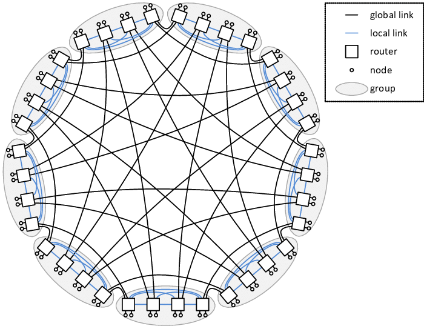
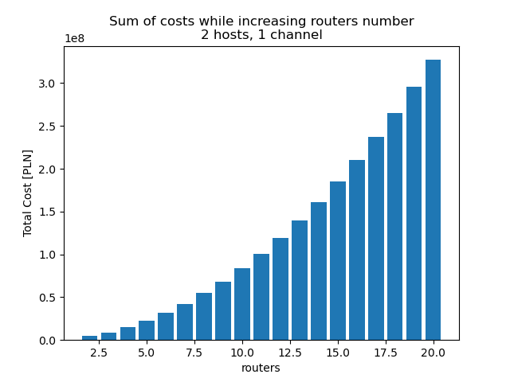
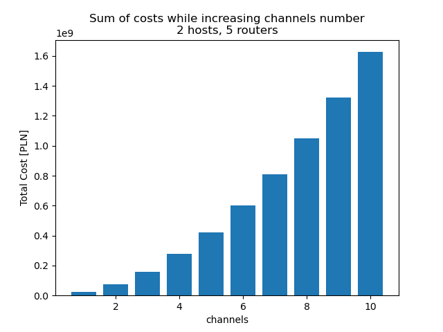

# DragonFlyNetworkAnalysis

## Introduction
Project presents creation of a large-scale dragonfly network model in NetBox tool using automation script written in Python. On the network model with reasonable amount of nodes the cost and scalability analysis was performed. The solution also provides an example physical setup using [Mellanox](https://www.nvidia.com/en-us/networking/infiniband-configurator/) switches and AOC cables.

## [Dragonfly topology](https://static.googleusercontent.com/media/research.google.com/pl//pubs/archive/34926.pdf)

Topology introduced in cooperation with Google to create a highly-scalable, low-latency and low-cost networks between data centers. It focuses on minimizing the number and length of interconenction cables, which can otherwise dominate the network costs. Nodes are connected to routers gathered into groups in which they are densely connected. Each group has a minimum of one connection to every other. As a result, a maximum of one inter-group connection has to be used to route a packet between any two nodes.



The [above graph](https://www.researchgate.net/figure/Sample-Dragonfly-topology-with-h2-p2-a4-36-routers-and-72-compute-nodes_fig2_261313973) presents the topology with 9 groups, 4 routers in each group, 2 channels and 2 hosts (nodes) per router.

## [NetBox simulation tool](https://docs.netbox.dev/en/stable/introduction/)

NetBox is an open source tool for modeling and documenting modern networks. It provides a wide assortment of objects to allow creating infrastructure desing and document network starting from cabling, to IP address managements.

NetBox is highly customizable and extensible tool through plugins such as metrics or new functionalities.

The most important feature for us is [**scripting**](https://docs.netbox.dev/en/stable/getting-started/populating-data/), which allows us to start from a small network and easily scale it in to a bigger one.

NetBox also contains [**REST API**](https://docs.netbox.dev/en/stable/integrations/rest-api/) to facilitate the population of data. Also it supports the bulk creation of multiple objects using only a single request.

## NetBox environment configuration
To configure the NetBox tool, it is recommended to use a `netbox-docker` project. The simple installation method is explained [here](https://github.com/netbox-community/netbox-docker#quickstart).

## Generator script usage

The `dragonfly_topology.py` Python script can be used as follows:
```bash
dragonfly_topology.py [-h] [--setup] [--hosts HOSTS] [--routers ROUTERS] [--channels CHANNELS] [--costs]

options:
  -h, --help           show this help message and exit
  --setup              Setup sites, manufacturers, device roles and device types
  --hosts HOSTS        Number of hosts connected to each router
  --routers ROUTERS    Number of routers in each group
  --channels CHANNELS  Number of channels within each router used to connect to other groups
  --costs              Print information about cost of the network
```

By default, the script generates the Dragonfly topology. Using `--hosts`, `--routers` and `--channels` flags, it is highly configurable allowing to set crucial topology parameters. The number of groups in the system is calculated using the formula: `routers * channels + 1`. It means that all groups have exactly one direct connection to each other. Inside the groups, all routers are connected as a complete graph.

The `--setup` flag should be used when generating the topology for the first time. Besides the devices, interfaces and cables it also sets up the site, device roles, types, manufacturers as well as the `price` custom field bound to the device types and cables for analysis purposes.

Using `--costs` flag it is possible to calculate the costs of the generated topology, grouped by routers, hosts and cables.

To use the above script, it is required to fill the Netbox API token in `NETBOX_TOKEN` environtment variable and if needed, change the `NETBOX_URL` variable in the script.

### Example usage

The following code generates the topology presented on the graph above. It also sets up the initial settings (`--setup` flag).

```bash
NETBOX_TOKEN=[token] python dragonfly_topology.py --setup --hosts 2 --routers 4 --channels 2
```

## Scalability analysis
Scalability analysis was performed based on price of building network from below devices:

Devices:

|        | Name                  | Price     |
|--------|-----------------------|-----------|
| Router | Mellanox MQM8790-HS2F | 71472 PLN |
| Host   | Dell PowerEdge R450   | 21000 PLN |

Connections:

|             | Name                   | Price/m | Length |
|-------------|------------------------|---------|--------|
| Inter-group | Mellanox MFS1S00-H150E | 25 PLN  | 50 km  |
| Intra-group | Mellanox MFS1S00-H100E | 35 PLN  | 100 m  |
| Host        | MFS1S50-H010E          | 360 PLN | 10 m   |




On above plots we can see that cost of the network grows exponentially with the size of the network, but the factor is much lower than for fully connected topologies.